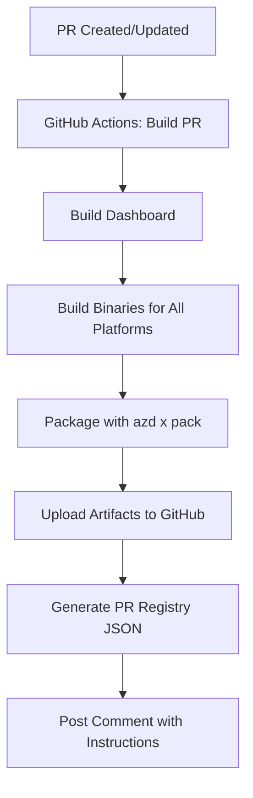
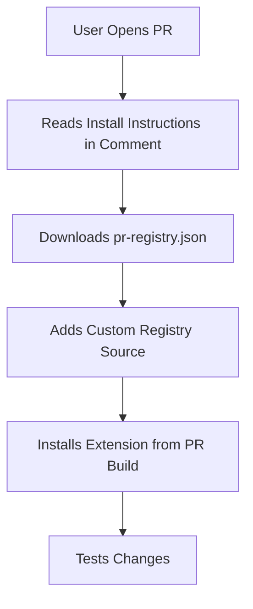

# PR Build Distribution Process

## Overview

This document outlines the automated process for building and distributing pre-release versions of the AZD App extension from pull requests, allowing end users to test changes before they're merged.

## Goals

1. **Automatic PR Builds**: Every PR automatically builds all platform binaries
2. **Easy Installation**: Users can install PR builds with minimal steps
3. **Clear Instructions**: Auto-posted comment on each PR with installation steps
4. **Seamless UX**: Leverage `azd x` tooling for consistency with production releases

## Architecture

### Build Process



### Installation Flow



## Implementation

### 1. GitHub Actions Workflow

Create `.github/workflows/pr-build.yml`:

```yaml
name: PR Build

on:
  pull_request:
    branches: [ main ]
    paths:
      - 'cli/**'
      - '.github/workflows/pr-build.yml'
  workflow_dispatch:

defaults:
  run:
    working-directory: cli

jobs:
  build-pr:
    name: Build PR Preview
    runs-on: ubuntu-latest
    permissions:
      contents: write
      pull-requests: write
    
    steps:
      - name: Checkout code
        uses: actions/checkout@v4

      - name: Set up Go
        uses: actions/setup-go@v5
        with:
          go-version: '1.25'
          cache-dependency-path: cli/go.sum

      - name: Set up Node.js
        uses: actions/setup-node@v4
        with:
          node-version: '20'
          cache: 'npm'
          cache-dependency-path: cli/dashboard/package.json

      - name: Calculate PR version
        id: version
        run: |
          BASE_VERSION=$(grep '^version:' extension.yaml | awk '{print $2}')
          PR_VERSION="${BASE_VERSION}-pr${{ github.event.pull_request.number }}"
          echo "version=$PR_VERSION" >> $GITHUB_OUTPUT
          echo "Building version: $PR_VERSION"

      - name: Install azd
        run: curl -fsSL https://aka.ms/install-azd.sh | bash

      - name: Install azd extensions
        run: azd extension install microsoft.azd.extensions

      - name: Build dashboard
        run: |
          cd dashboard
          npm ci
          npm run build
          cd ..

      - name: Build binaries
        run: |
          export EXTENSION_ID="jongio.azd.app"
          export EXTENSION_VERSION="${{ steps.version.outputs.version }}"
          azd x build --all

      - name: Package
        run: azd x pack

      - name: Upload packaged artifacts
        uses: actions/upload-artifact@v4
        with:
          name: pr-${{ github.event.pull_request.number }}-binaries
          path: ~/.azd/registry/jongio.azd.app/${{ steps.version.outputs.version }}/*
          retention-days: 30

      - name: Generate PR registry
        id: registry
        run: |
          VERSION="${{ steps.version.outputs.version }}"
          PR_NUM="${{ github.event.pull_request.number }}"
          RUN_ID="${{ github.run_id }}"
          REPO="${{ github.repository }}"
          
          # Create a custom registry.json for this PR
          cat > pr-registry.json <<EOF
          {
            "extensions": [
              {
                "id": "jongio.azd.app",
                "namespace": "app",
                "displayName": "App Extension (PR #$PR_NUM Preview)",
                "description": "Preview build from PR #$PR_NUM - A collection of developer productivity commands for Azure Developer CLI",
                "versions": [
                  {
                    "version": "$VERSION",
                    "capabilities": [
                      "custom-commands",
                      "lifecycle-events",
                      "mcp-server"
                    ],
                    "usage": "azd app <command> [options]",
                    "examples": [
                      {
                        "name": "hi",
                        "description": "Say hello and display extension info",
                        "usage": "azd app hi"
                      },
                      {
                        "name": "reqs",
                        "description": "Verify all prerequisites are installed",
                        "usage": "azd app reqs"
                      }
                    ],
                    "artifacts": {
                      "darwin/amd64": {
                        "entryPoint": "jongio-azd-app-darwin-amd64",
                        "url": "https://github.com/$REPO/actions/runs/$RUN_ID/artifacts/jongio-azd-app-darwin-amd64.zip"
                      },
                      "darwin/arm64": {
                        "entryPoint": "jongio-azd-app-darwin-arm64",
                        "url": "https://github.com/$REPO/actions/runs/$RUN_ID/artifacts/jongio-azd-app-darwin-arm64.zip"
                      },
                      "linux/amd64": {
                        "entryPoint": "jongio-azd-app-linux-amd64",
                        "url": "https://github.com/$REPO/actions/runs/$RUN_ID/artifacts/jongio-azd-app-linux-amd64.tar.gz"
                      },
                      "linux/arm64": {
                        "entryPoint": "jongio-azd-app-linux-arm64",
                        "url": "https://github.com/$REPO/actions/runs/$RUN_ID/artifacts/jongio-azd-app-linux-arm64.tar.gz"
                      },
                      "windows/amd64": {
                        "entryPoint": "jongio-azd-app-windows-amd64.exe",
                        "url": "https://github.com/$REPO/actions/runs/$RUN_ID/artifacts/jongio-azd-app-windows-amd64.zip"
                      },
                      "windows/arm64": {
                        "entryPoint": "jongio-azd-app-windows-arm64.exe",
                        "url": "https://github.com/$REPO/actions/runs/$RUN_ID/artifacts/jongio-azd-app-windows-arm64.zip"
                      }
                    }
                  }
                ],
                "tags": [
                  "developer",
                  "productivity",
                  "app",
                  "preview"
                ]
              }
            ]
          }
          EOF

      - name: Upload PR registry
        uses: actions/upload-artifact@v4
        with:
          name: pr-${{ github.event.pull_request.number }}-registry
          path: cli/pr-registry.json
          retention-days: 30

      - name: Generate installation instructions
        id: instructions
        run: |
          VERSION="${{ steps.version.outputs.version }}"
          PR_NUM="${{ github.event.pull_request.number }}"
          RUN_ID="${{ github.run_id }}"
          REPO="${{ github.repository }}"
          
          cat > instructions.md <<'EOF'
          ## 🚀 Test This PR

          A preview build is available for testing. Follow these steps to install:

          ### Option 1: Quick Install (Recommended)

          **Step 1:** Download the artifacts for your platform from this workflow run:
          - [Download artifacts](https://github.com/${{ github.repository }}/actions/runs/${{ github.run_id }})

          **Step 2:** Extract and install manually:
          ```bash
          # Extract the downloaded archive for your platform
          # Windows (PowerShell):
          Expand-Archive -Path jongio-azd-app-windows-amd64.zip -DestinationPath ~\.azd\bin\jongio.azd.app\$VERSION

          # macOS/Linux:
          mkdir -p ~/.azd/bin/jongio.azd.app/$VERSION
          tar -xzf jongio-azd-app-darwin-arm64.tar.gz -C ~/.azd/bin/jongio.azd.app/$VERSION
          ```

          **Step 3:** Test it:
          ```bash
          azd app version  # Should show $VERSION
          azd app reqs
          azd app hi
          ```

          ### Option 2: Custom Registry (Advanced)

          If you have GitHub CLI (`gh`) installed and authenticated:

          **Step 1:** Download the PR registry file:
          ```bash
          gh run download $RUN_ID --repo $REPO --name pr-$PR_NUM-registry
          ```

          **Step 2:** Add custom registry source:
          ```bash
          # First, ensure extensions are enabled
          azd config set alpha.extension.enabled on

          # Add the PR registry as a custom source
          azd extension source add -n pr-$PR_NUM -t file -l "$(pwd)/pr-registry.json"
          ```

          **Step 3:** Install the preview build:
          ```bash
          azd extension install jongio.azd.app --version $VERSION
          ```

          **Step 4:** Test it:
          ```bash
          azd app version  # Should show $VERSION
          azd app reqs
          azd app hi
          ```

          ### Cleanup After Testing

          **Remove the preview build:**
          ```bash
          azd extension uninstall jongio.azd.app
          ```

          **Remove the custom registry source (if using Option 2):**
          ```bash
          azd extension source remove pr-$PR_NUM
          ```

          **Reinstall the stable version:**
          ```bash
          azd extension source add -n app -t url -l "https://raw.githubusercontent.com/jongio/azd-app/refs/heads/main/registry.json"
          azd extension install jongio.azd.app
          ```

          ---

          ### Build Information
          - **Version:** `$VERSION`
          - **PR:** #$PR_NUM
          - **Run ID:** $RUN_ID
          - **Commit:** ${{ github.event.pull_request.head.sha }}

          ### What to Test
          EOF
          
          # Extract PR body to suggest what to test
          echo "Please review the PR description for specific areas to test." >> instructions.md

      - name: Comment on PR
        uses: actions/github-script@v7
        with:
          script: |
            const fs = require('fs');
            const instructions = fs.readFileSync('cli/instructions.md', 'utf8')
              .replace(/\$\{\{ github\.repository \}\}/g, '${{ github.repository }}')
              .replace(/\$\{\{ github\.run_id \}\}/g, '${{ github.run_id }}')
              .replace(/\$\{\{ github\.event\.pull_request\.number \}\}/g, '${{ github.event.pull_request.number }}')
              .replace(/\$VERSION/g, '${{ steps.version.outputs.version }}')
              .replace(/\$PR_NUM/g, '${{ github.event.pull_request.number }}')
              .replace(/\$RUN_ID/g, '${{ github.run_id }}')
              .replace(/\$REPO/g, '${{ github.repository }}');
            
            // Find existing comment
            const comments = await github.rest.issues.listComments({
              owner: context.repo.owner,
              repo: context.repo.repo,
              issue_number: context.issue.number,
            });
            
            const botComment = comments.data.find(comment => 
              comment.user.type === 'Bot' && 
              comment.body.includes('🚀 Test This PR')
            );
            
            const commentBody = instructions;
            
            if (botComment) {
              // Update existing comment
              await github.rest.issues.updateComment({
                owner: context.repo.owner,
                repo: context.repo.repo,
                comment_id: botComment.id,
                body: commentBody
              });
            } else {
              // Create new comment
              await github.rest.issues.createComment({
                owner: context.repo.owner,
                repo: context.repo.repo,
                issue_number: context.issue.number,
                body: commentBody
              });
            }
```

### 2. Alternative Approach: Using GitHub Releases

For a more seamless experience, we can use pre-release GitHub releases instead of artifacts:

```yaml
      - name: Create PR pre-release
        run: |
          VERSION="${{ steps.version.outputs.version }}"
          PR_NUM="${{ github.event.pull_request.number }}"
          
          # Create pre-release tag
          git tag -a "pr-$PR_NUM-$VERSION" -m "PR #$PR_NUM preview build"
          git push origin "pr-$PR_NUM-$VERSION"
          
          # Create GitHub pre-release
          azd x release \
            --repo "${{ github.repository }}" \
            --version "$VERSION" \
            --tag "pr-$PR_NUM-$VERSION" \
            --prerelease \
            --notes "Preview build for PR #$PR_NUM" \
            --confirm
        env:
          GITHUB_TOKEN: ${{ secrets.GITHUB_TOKEN }}

      - name: Publish to PR registry
        run: |
          # Generate registry with GitHub release URLs
          azd x publish \
            --registry ./pr-registry.json \
            --version "${{ steps.version.outputs.version }}" \
            --repo "${{ github.repository }}" \
            --tag "pr-${{ github.event.pull_request.number }}-${{ steps.version.outputs.version }}"
```

With this approach, the installation instructions simplify to:

```bash
# Download PR registry
curl -o pr-registry.json https://github.com/jongio/azd-app/releases/download/pr-123-0.5.7-pr123/pr-registry.json

# Add registry source
azd extension source add -n pr-123 -t file -l "$(pwd)/pr-registry.json"

# Install
azd extension install jongio.azd.app --version 0.5.7-pr123
```

## Recommendation: Option 2 (GitHub Pre-releases)

**Best approach:** Use GitHub pre-releases for PR builds.

### Advantages

1. **Native `azd x` integration**: Leverages existing tooling
2. **Consistent UX**: Same installation flow as production releases
3. **No artifact download complexity**: GitHub releases provide direct URLs
4. **Automatic cleanup**: Pre-releases can be auto-deleted after PR merge/close
5. **Registry compatibility**: Works exactly like production registry

### User Flow

```bash
# One-time setup
azd config set alpha.extension.enabled on

# Per-PR testing (from PR comment instructions)
curl -O https://github.com/jongio/azd-app/releases/download/pr-123-v0.5.7-pr123/pr-registry.json
azd extension source add -n pr-123 -t file -l "$(pwd)/pr-registry.json"
azd extension install jongio.azd.app --version 0.5.7-pr123

# Test
azd app version
azd app reqs

# Cleanup
azd extension uninstall jongio.azd.app
azd extension source remove pr-123
rm pr-registry.json
```

## PR Comment Template

The automated comment will look like:

````markdown
## 🚀 Test This PR

A preview build (`0.5.7-pr123`) is ready for testing!

### Quick Start

**1. Download the registry file:**
```bash
curl -O https://github.com/jongio/azd-app/releases/download/pr-123-v0.5.7-pr123/pr-registry.json
```

**2. Add as a custom registry source:**
```bash
azd config set alpha.extension.enabled on
azd extension source add -n pr-123 -t file -l "$(pwd)/pr-registry.json"
```

**3. Install the preview:**
```bash
azd extension install jongio.azd.app --version 0.5.7-pr123
```

**4. Verify:**
```bash
azd app version  # Should output: azd app extension version 0.5.7-pr123
azd app hi
azd app reqs
```

### Cleanup

When you're done testing:
```bash
azd extension uninstall jongio.azd.app
azd extension source remove pr-123
rm pr-registry.json
```

To reinstall stable:
```bash
azd extension source add -n app -t url -l "https://raw.githubusercontent.com/jongio/azd-app/refs/heads/main/registry.json"
azd extension install jongio.azd.app
```

---

**Build Info:**
- Version: `0.5.7-pr123`
- Commit: `abc1234`
- Release: [pr-123-v0.5.7-pr123](https://github.com/jongio/azd-app/releases/tag/pr-123-v0.5.7-pr123)

**What Changed:**
[Auto-extracted from PR description or commit messages]
````

## Maintenance

### Cleanup Strategy

Add cleanup job to remove old PR pre-releases:

```yaml
  cleanup:
    name: Cleanup Old PR Builds
    runs-on: ubuntu-latest
    if: github.event.pull_request.merged == true || github.event.pull_request.state == 'closed'
    steps:
      - name: Delete PR pre-release
        uses: actions/github-script@v7
        with:
          script: |
            const prNum = context.issue.number;
            
            // List all releases
            const releases = await github.rest.repos.listReleases({
              owner: context.repo.owner,
              repo: context.repo.repo,
            });
            
            // Find and delete PR releases
            for (const release of releases.data) {
              if (release.tag_name.startsWith(`pr-${prNum}-`)) {
                await github.rest.repos.deleteRelease({
                  owner: context.repo.owner,
                  repo: context.repo.repo,
                  release_id: release.id,
                });
                
                // Delete the tag too
                await github.rest.git.deleteRef({
                  owner: context.repo.owner,
                  repo: context.repo.repo,
                  ref: `tags/${release.tag_name}`,
                });
              }
            }
```

## Implementation Checklist

- [ ] Create `.github/workflows/pr-build.yml`
- [ ] Add PR comment template generation logic
- [ ] Configure GitHub Actions permissions
- [ ] Add cleanup workflow for closed/merged PRs
- [ ] Test with a sample PR
- [ ] Update contributing documentation
- [ ] Add troubleshooting guide

## Troubleshooting

### Common Issues

**1. "Extension already installed"**
```bash
azd extension uninstall jongio.azd.app
# Then reinstall
```

**2. "Registry not found"**
- Ensure the `pr-registry.json` file path is correct
- Use absolute path: `azd extension source add -n pr-123 -t file -l "/full/path/to/pr-registry.json"`

**3. "Wrong version installed"**
```bash
azd app version
azd extension uninstall jongio.azd.app
# Clear cache
rm -rf ~/.azd/extensions/jongio.azd.app
# Reinstall
```

## Future Enhancements

1. **Web-based installer**: Generate a script that automates all steps
2. **QR code in comment**: For mobile testing
3. **Automatic version comparison**: Show diff from main
4. **Test reports**: Auto-run smoke tests and post results
5. **Platform-specific instructions**: Detect OS and show relevant commands
